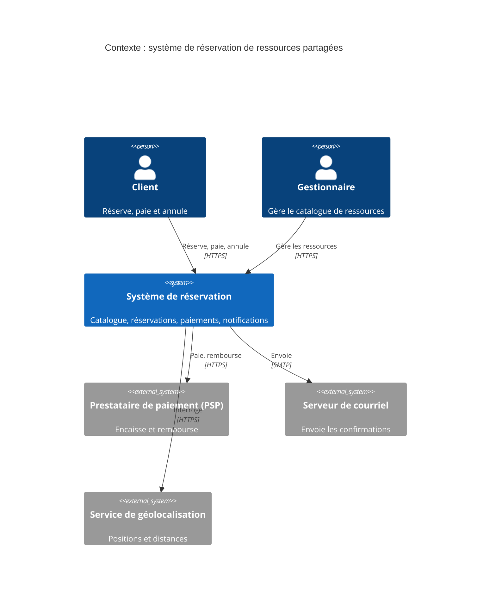

# C4 niveau 1 : contexte système (gabarit générique)

```mermaid
C4Context
  title Contexte : système de réservation de ressources partagées
  Person(client, "Client", "Réserve, paie et annule")
  Person(gestionnaire, "Gestionnaire", "Gère le catalogue de ressources")
  System(reservation, "Système de réservation", "Catalogue, réservations, paiements, notifications")
  System_Ext(psp, "Prestataire de paiement (PSP)", "Encaisse et rembourse")
  System_Ext(mail, "Serveur de courriel", "Envoie les confirmations")
  System_Ext(geo, "Service de géolocalisation", "Positions et distances")

  Rel(client, reservation, "Réserve, paie, annule", "HTTPS")
  Rel(gestionnaire, reservation, "Gère les ressources", "HTTPS")
  Rel(reservation, psp, "Paie, rembourse", "HTTPS")
  Rel(reservation, mail, "Envoie", "SMTP")
  Rel(reservation, geo, "Interroge", "HTTPS")
```
