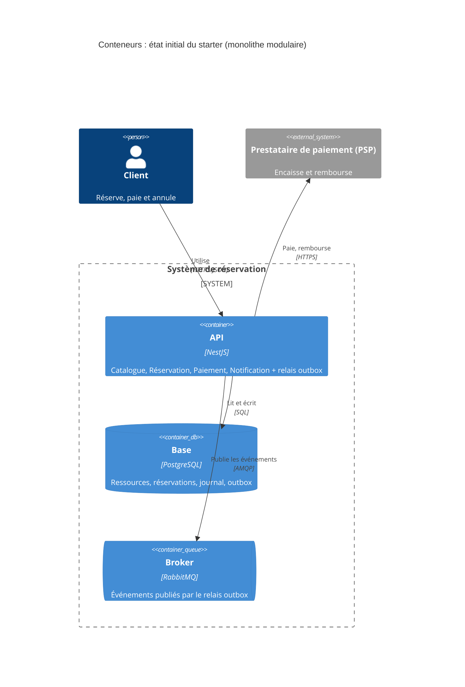

# C4 niveau 2 : conteneurs (gabarit générique)

```mermaid
C4Container
  title Conteneurs : état initial du starter (monolithe modulaire)
  Person(client, "Client", "Réserve, paie et annule")
  System_Ext(psp, "Prestataire de paiement (PSP)", "Encaisse et rembourse")

  System_Boundary(systeme, "Système de réservation") {
    Container(api, "API", "NestJS", "Catalogue, Réservation, Paiement, Notification + relais outbox")
    ContainerDb(db, "Base", "PostgreSQL", "Ressources, réservations, journal, outbox")
    ContainerQueue(broker, "Broker", "RabbitMQ", "Événements publiés par le relais outbox")
  }

  Rel(client, api, "Utilise", "HTTPS/JSON")
  Rel(api, db, "Lit et écrit", "SQL")
  Rel(api, broker, "Publie les événements", "AMQP")
  Rel(api, psp, "Paie, rembourse", "HTTPS")
```
