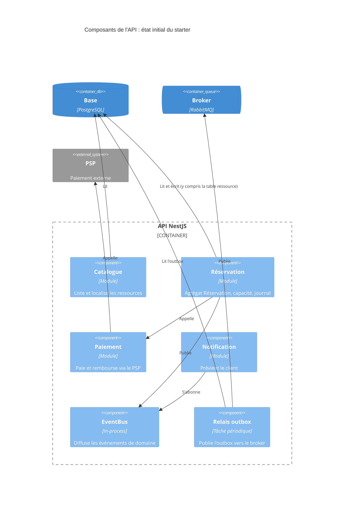

# C4 niveau 3 : composants du conteneur API (gabarit générique)

```mermaid
C4Component
  title Composants de l'API : état initial du starter
  ContainerDb(db, "Base", "PostgreSQL")
  ContainerQueue(broker, "Broker", "RabbitMQ")
  System_Ext(psp, "PSP", "Paiement externe")

  Container_Boundary(api, "API NestJS") {
    Component(catalogue, "Catalogue", "Module", "Liste et localise les ressources")
    Component(reservation, "Réservation", "Module", "Agrégat Réservation, capacité, journal")
    Component(paiement, "Paiement", "Module", "Paie et rembourse via le PSP")
    Component(notification, "Notification", "Module", "Prévient le client")
    Component(bus, "EventBus", "In-process", "Diffuse les événements de domaine")
    Component(outbox, "Relais outbox", "Tâche périodique", "Publie l'outbox vers le broker")
  }

  Rel(reservation, paiement, "Appelle")
  Rel(reservation, bus, "Publie")
  Rel(notification, bus, "S'abonne")
  Rel(catalogue, db, "Lit")
  Rel(reservation, db, "Lit et écrit (y compris la table ressource)")
  Rel(paiement, psp, "Appelle")
  Rel(outbox, db, "Lit l'outbox")
  Rel(outbox, broker, "Publie")
```
